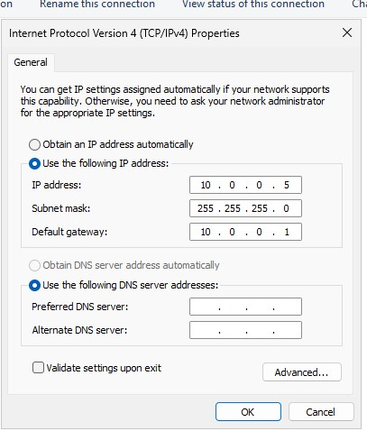
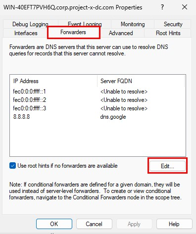
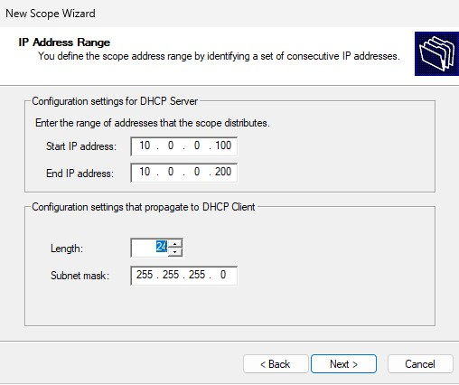
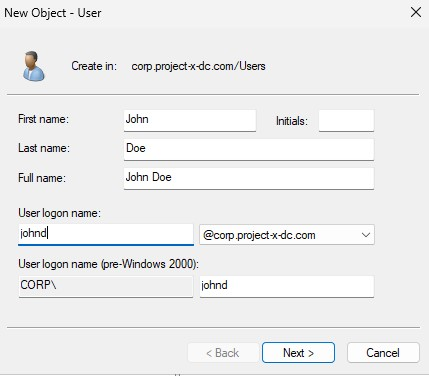

# Active Direcotry

Active Directory (AD) is a directory service developed by Microsoft that manages and organizes resources in a network. It acts as a centralized database to authenticate and authorize users and devices, making it the backbone of most Windows-based enterprise environments.
There are three key components in AD:
- Authentication: Verifies user identity using credentials like username and password.
- Authorization: Grants or denies access to network resources based on permissions.
- Management: Centralizes control over users, computers, and other resources.

# Core Concepts
- a domain is a logical grouping of objects (users, devices, etc.) that share the same database and security policies
corp.project-x-dc.com will be the domain used in this project
- domain controllers are Servers that host the Active Directory database and perform authentication, authorization, and replication to other AD databases
- organizational units = containers within a domain used to organize objects logically
e.g. Separate OUs for HR, IT, and Finance
- objects = Every entity in AD, such as users, computers, printers, and groups, is an object
- groups = Used for managing permissions to resources and for email distribution
- forests and trees = A forest is the highest-level container, encompassing multiple domains that share a common schema. - A tree is a hierarchy of domains within a forest
- trust relationships = Trusts enable users in one domain to access resources in another domain

Active Directory is often a prime target for attackers due to its central role in managing network resources. Misconfigurations or vulnerabilities can lead to significant security risks.
Common Security Threats:
- Credential Theft : Techniques like Pass-the-Hash or Kerberoasting can allow attackers to escalate privileges.
- Privilege Escalation : Exploiting misconfigured permissions to gain higher access levels.
- Lateral Movement : Once inside, attackers can move through the network using AD to identify valuable targets.

# Setup

This server is asigned a static IP address

This server will also be the domain controller, and also the DNS and DHCP server for this network.
To correctly handle DNS requests for all connected devices, including workstations and other networked systems, we need to add the 8.8.8.8 address as a forwarder. This is the address for the Google DNS server.

For the DHCP part, I just defined the scope address range. I also set the default gateway with the 10.0.0.1 address.

In the end, i will add the user accounts in AD. Each account will be associated to a workstation.
For this project, I will add the users John and Jane Doe.

