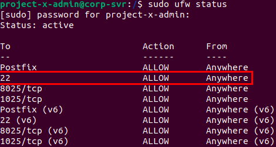

Now that the corporate network has been set up, i can move on to adding some vulnerabilities to the system, that i can later exploit in order to gain access to infrastructure and information.

- first i will install OpenSSH server on the corporate server with: sudo apt install openssh-server -y
- then start and enable the SSH protocol:
	- sudo systemctl start ssh
	- sudo systemctl enable ssh
- change UFW rules to allow ssh conncections, that communicate on port 22, so we need to tell the firewall to open that port:
	- sudo ufw allow 22
	- sudo ufw enable
	- sudo ufw status



- then in the SSH configuration file i need to enable the PasswordAuthentication and the PermitRootLogin options

Same steps for the linux-client machine.

Now I need to enable WinRM on the windows-client machine using the following commands in Powershell with Administrator privileges:
```powershell
powershell -ep bypass
Enable-PSRemoting -force
winrm quickconfig -transport:https
Set-Item wsman:\localhost\client\trustedhosts *
net localgroup "Remote Management Users" /add administrator
Restart-Service WinRM
```

Now, in the Active Directory server:
- first, i enable the RDP (remote desktop protocol) in the settings

After that i will set up a sensitive file;
- inside the Documents folder, i will create another folder called "ProductionFiles"
- inside that there is a text file containing "secrets"

