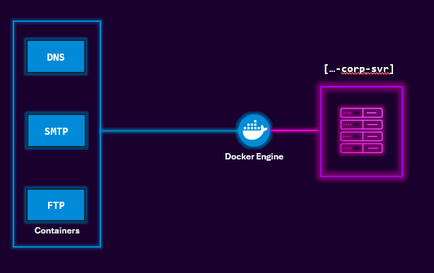
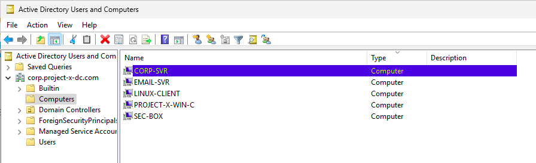

Business and enterprise environments will have dedicated servers designated for different purposes. Servers empower the backend processing of user and service requests.
Depending on the size and scale of a company, they may have hundreds, if not thousands of dedicated servers.
Running on-premise, where they must manage and operate the server from the hardware to application level, or in the cloud, where parts of the process is managed from the cloud provider.

I am going to provision and create a dedicated server called `[project-x-corp-svr]`.
This server is going to act as a Jumpbox. From this server i will provision and access other types of services such as FTP, DNS, and email.
Without access to the Jumpbox, all other services such as FTP, DNS, and email will not be accessible, meaning i won't be able to manage, upgrade, or access these services. This is intentional. Jumpboxes can be created to restrict access, minimizing the attack surface

These internal "servers" will be containers. I could use additional VMs, however, this would mean more dedicated storage, compute, and other resources

Containers are isolated environments that package an application and all its dependencies (binaries, libraries, config files) together. They run from Docker images and share the host OS kernel
- **Docker**: A platform for developing, shipping, and running applications inside lightweight, portable, and isolated environments called containers. It enables consistent application behavior across different environments—from development to production.
- **Docker Engine**: The application or program that runs in the background to enable containerization.

Running a dedicated server requires proper management. Without proper security controls in place, attackers can break inside
Specifically when we think about Jumpboxes, if a threat actor is able to get access, then they have access to the internal environment.
Additional security considerations: 
- Single Point of Failure: If compromised, the jumpbox can provide access to the entire internal network it protects.
- Lateral Movement: If lateral movement protections (e.g., credential guard, firewall rules, endpoint detection) are weak, attackers can move from the jumpbox to other internal systems.
- Lack of Monitoring: If session activity, command history, or file transfers are not logged or monitored, malicious actions may go unnoticed.

For the Corporate server, i will clone the alreaedy existing linux client, and add the following modifications:
- change the IPv4 address from 10.0.0.101 to 10.0.0.8
- change the hostname: sudo hostnamectl set-hostname corp-svr
- provision a new dedicated user account:
	- sudo adduser project-x-admin (set the password to @password123!)
	- sudo usermod -aG sudo project-x-admin (add the new user to the sudo user group)
- finally, switch to the newly created user

Next, i need to add this machine to the Active Directory:
- join the CORP domain under the Administrator account:  sudo net ad join -U Administrator
	- now the new machine should be visible in the active directory dashboard

- log into the Administrator account through CORP-SVR:
	- sudo login
	- CORP+Administrator
	- type the Administrator password
	- this will create a new home directory on the server (/home/administrator)

After this step is completed, i need to install docker engine, using the documentation on the official site.
I can check the state of Docker by using the following commands:
- docker pull hello-world
- docker run hello-world
If the machine can pull and run this docker image and sun as a container, then everything is ready to go.

