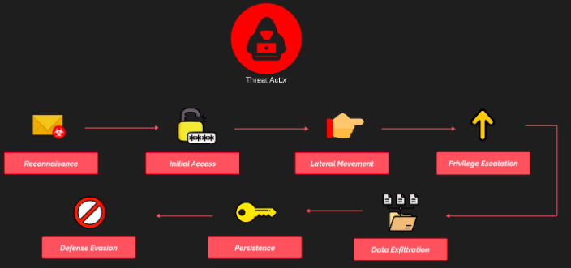

## The Scenario
In this part of the lab series, i am going to simulate an end-to-end cyber-attack on ProjectX’s business network. The end goal is to capture sensitive files and achieve persistence inside the business network, so that i can log back in at any time.
Up until this point, i have built an enterprise or business network to “emulate” a real-world environment.

By leveraging default, insecure, and outdated configurations and software, our attacker wants to use their skills for their own personal gain. These configurations, although outdated and disabled by default, can still often be found in business networks to this day.
Our attacker is financially motivated, attempting to steal sensitive data. They have identified ProjectX as a target organization to conduct their operations so they can extort and steal some sensitive information, perhaps a username, password, and proprietary files.
🧠 Attacker Motive: **Financially Motivated**
🏆 Goal: **Exfiltrate Sensitive Data**

Each of these steps aims to achieve a specific outcome. To conduct a successful cyber-attack, its imperative attackers take the proactive steps from initial access to persistence.
These steps are leveraged in separate phases but are often chained together. For example, once an attacker gains initial access or lateral movement, they will perform additional reconnaissance on the network to see what is available.
Most often, attackers want to stay hidden in the network with unfettered access for as long as possible. Each of these steps brings the attacker closer to their end goal or motive.

## 👀 Reconnaissance
Also referred to as 'recon'. This is first phase of a cyber-attack where attackers gather information about their target to identify vulnerabilities they can exploit. This phase is all about preparation and involves collecting as much data as possible about the target's systems, network, employees, or infrastructure without triggering alarms.

## 🎯 Initial Access
Attackers establish a foothold in the target’s environment. This is the entry point, achieved by exploiting vulnerabilities, phishing, using compromised credentials, or exploiting misconfigurations. The goal is to gain access to the target network while avoiding detection, setting the stage for further malicious activities.

## 👉 Lateral Movement
Attackers navigate through a compromised network to access more systems, resources, or sensitive data. They move from the initial access point by exploiting vulnerabilities, using stolen credentials, and leveraging tools at their disposal. The aim is to expand control and find valuable assets without raising suspicion.

## 📈 Privilege Escalation
Attackers increase their level of access within the target environment. This is done by exploiting system vulnerabilities, misconfigurations, or weak permissions to move from a standard user to an admin or system-level account. It allows attackers to execute critical tasks and access sensitive data more freely.

## 🚀 Data Exfiltration
Attackers transfer stolen data out of the target environment. This may include sensitive files, credentials, or intellectual property. Attackers often disguise or encrypt the data to evade detection during the transfer process, using channels like email, file-sharing platforms, or compromised systems.

## 📩 Persistence
Attackers ensure ongoing access to the compromised system even after reboots or initial detection attempts. This involves creating backdoors, modifying system configurations, or installing malware that enables them to maintain control over the environment for extended periods.

## ❌ Defense Evasion
Attackers employ techniques to avoid detection and bypass security measures. This includes obfuscating malware, disabling security tools, using fileless attacks, or manipulating logs. The objective is to operate undetected, prolonging their access and reducing the chances of discovery.
