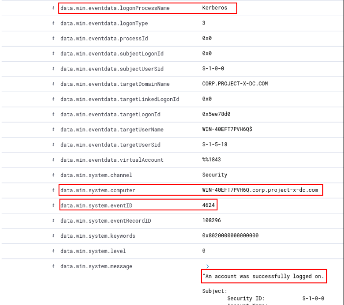
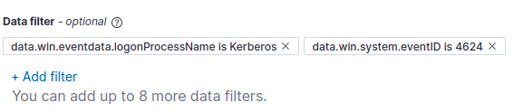

Any network like the one i set up in this project has (or should have) a comprehensive set of detection mechanism and alerts. However, in the configuration of my network there are gaps left on purpose for demonstrating how these gaps can compromise the security of the entire system.
In this part of the project i will explain in detail how i set up the detection and alert system for my project.

First of all, if i try to log in to the linux client using ssh and i enter the wrong password, a log with this event will be registered to Wazuh on my sec-box machine.
Wazuh has a built-in rule detection to detect authentication failures from the sshd daemon.
- Wazuh Rule ID: `5760`.
- Description: `sshd: authentication failed`.


Based on the information in this log, I can create a monitor that will alert me if there are three failed log in attempts on this machine.


Next i need to create a query, by adding some filters:


Final step is to add a trigger, so that once there are more than 2 failed attempts, the alert is sent.


## WinRM Alert

An Event ID does not exist for Enabling Win-RM as a service. However, i can detect WinRM logins through the Event ID `4624` with a `logonProcessName` of Kerberos as WinRM uses Kerberos.
Wazuh has a built-in rule detection to detect successful and unsuccessful authentication attempts into a Windows machine. The Windows Security Event IDs are `4624` (for successful) and `4625` (for failed).



With this information i can create an alert for WinRM log in failed attempts.
The steps are similar to the ones for the sshd log in failure on the linux machine.




## File integrty on AD

Next i will add file integrity monitoring for my Active Directory machine.
First step is to add the following code to the agent.conf file:
```xml
 <syscheck>
  <directories check_all="yes" report_changes="yes"
  realtime="yes">C:\Users\Administrator\Documents\ProductionFiles
  </directories>
  <frequency>60</frequency>
 </syscheck>
```
Now if i will change the contents of the secrets.txt file in the specified directory, a new event will appear in my Wazuh dashboard


After this is done, i can add a new rule and then an alert based on that rule.


I need to add the following code to the local_rules file:
```xml
<group name="syscheck">
 <rule id="100002" level="10">
 <field name="file">secrets.txt</field>
 <match>modified</match>
 <description>File integrity monitoring alert - access to
sensitive.txt file detected</description>
 </rule>
</group>
```
- this monitors the secrets.txt file created before
- the level tells the system what kind of alert to raise

Now i can create my alert.


`[project-x-corp-svr]` does not have the Wazuh agent installed. This is intentional to demonstrate how the absence of detection controls can create a gap in identifying potentially malicious activity.

