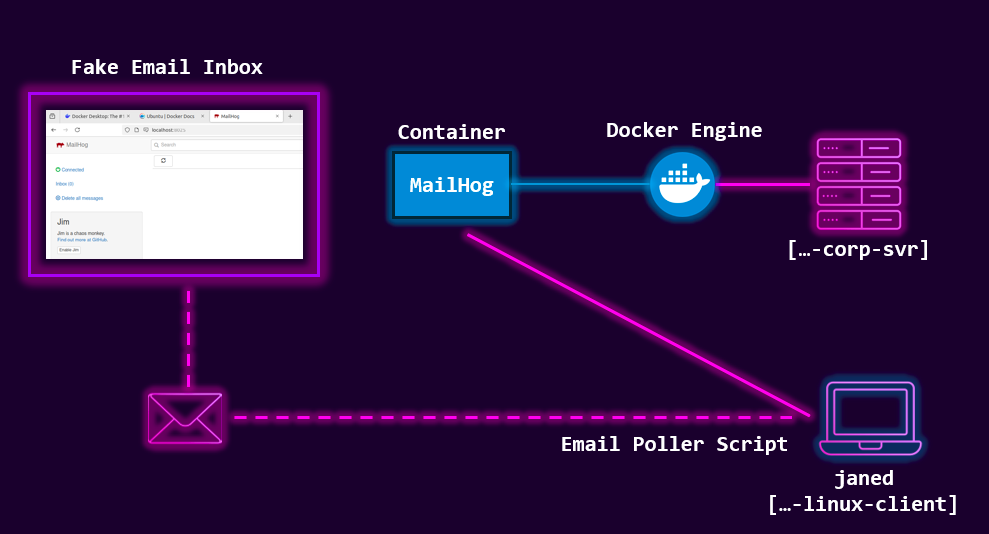
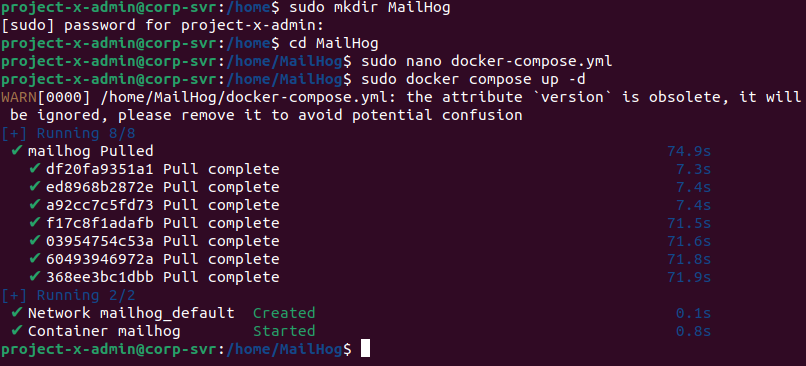
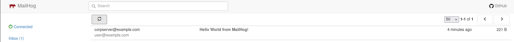
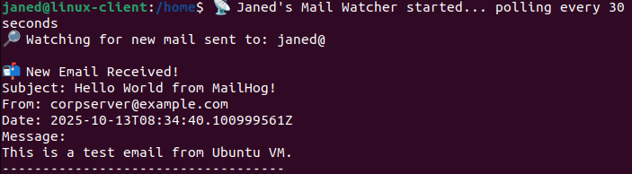

Email Server
This is the first service i will run on the corporate server.
An email server is a system designed to send, receive, store, and manage email communication for users. It uses protocols such as:
- SMTP (Simple Mail Transfer Protocol) for sending emails
- IMAP (Internet Message Access Protocol) or POP3 (Post Office Protocol) for receiving and managing email messages 



MailHog is a lightweight email testing tool that acts as a **fake SMTP server**. It **captures all outgoing emails** sent by applications, **without delivering** them to real inboxes. You can inspect emails via a **web interface or API**.
This makes it ideal for:
- Simulating corporate email infrastructure.
- Testing phishing or email-based attacks.
- Debugging apps that send emails.
- Avoiding spam filters or external mail services.

I will be using MailHog to simulate a business email server, which will be used as part of a phishing exercise.

MailHog Specifics
- **SMTP Server**: Listens on port `1025` by default
    - Apps can send mail via `localhost:1025`
- **Web UI**: Accessible on port `8025`
    - View messages, headers, attachments
- **API**: For scripting/test automation

Configure MailHog
MailHog provides a docker image ready to use form the docker hub. This allows me to pull the image and run MailHog through the docker container
- create a new directory in /home: sudo mkdir MailHog &&cd
- create a new docker compose file: sudo nano docker-compose.yml
		version: "3"
		services:
		  mailhog:
		    image: mailhog/mailhog
		    container_name: mailhog
		    ports:
		      - "1025:1025"
		      - "8025:8025"
- run sudo docker compose up -d



To see the MailHog UI, enter the following in the browser:
- http://localhost:8025
To test the service, i create a .py file in the home directory that uses Python's smtplib and email.message libraries to construct a test email. smtplib allows me to send the email message to our `localhost`, which is the Docker container running MailHog.

```n
import smtplib
from email.message import EmailMessage

msg = EmailMessage()
msg.set_content("This is a test email from Ubuntu VM.")
msg["Subject"] = "Hello World from MailHog!"
msg["From"] = "corpserver@example.com"
msg["To"] = "user@example.com"

with smtplib.SMTP("localhost", 1025) as server:
    server.send_message(msg)
```

- give this script executable permissions: sudo chmod +x test_message.py
- run the script: sudo python3 test_message.py
After that, the message will appear in the browser interface



Now i can simulate an email polling service.
This will allow me to get new email message notifications inside the project-x-linux-client host.

- inside the linux client, using the Jane Doe account
- `curl` will be used to fetch our email server URL. `jq` is used to filter JSON strings
- Create a new Bash script with Nano: `sudo nano email_poller.sh`
```bash
#!/bin/bash

MAILHOG_IP="10.0.0.8"  
TO_EMAIL="janed"
POLL_INTERVAL=30  # seconds

echo "📡 Janed's Mail Watcher started... polling every $POLL_INTERVAL seconds"
echo "🔎 Watching for new mail sent to: $TO_EMAIL@"

# Keep track of seen message IDs
SEEN_IDS_FILE="/tmp/mailhog_seen_ids_janed.txt"
touch "$SEEN_IDS_FILE"

while true; do
  # Fetch current message list
  curl -s http://$MAILHOG_IP:8025/api/v2/messages | jq -c '.items[]' | while read -r msg; do
    TO=$(echo "$msg" | jq -r '.To[].Mailbox')
    ID=$(echo "$msg" | jq -r '.ID')

    if [[ "$TO" == "$TO_EMAIL" && ! $(grep -Fx "$ID" "$SEEN_IDS_FILE") ]]; then
      SUBJECT=$(echo "$msg" | jq -r '.Content.Headers.Subject[0]')
      BODY=$(echo "$msg" | jq -r '.Content.Body')

      echo -e "\n📬 New Email Received!"
      echo "Subject: $SUBJECT"
      echo "From: $(echo "$msg" | jq -r '.Content.Headers.From[0]')"
      echo "Date: $(echo "$msg" | jq -r '.Created')"
      echo -e "Message:\n$BODY"
      echo "-----------------------------------"

      echo "$ID" >> "$SEEN_IDS_FILE"
    fi
  done

  sleep "$POLL_INTERVAL"
done
```

- make the script executable: sudo chmod +x email_poller.sh
- run the script: sudo ./email_poller.sh

Now if i send another email from the corp-svr to this user, i will see the following message in the terminal:


