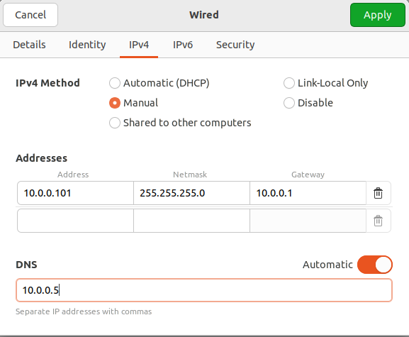
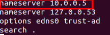
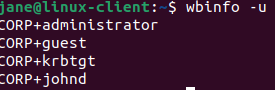
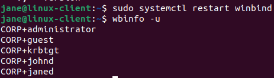
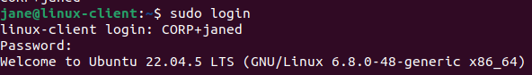
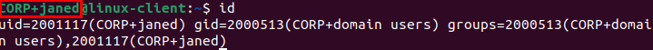

For the linux client machine, i will use Ubuntu. After booting the OS, i need to configure a static IPv4 address:

I want to be able co copy and paste things from my main machine to the Vm. For that i need to install guest additions.
- first, i run the commands:
	- sudo apt update
	- sudo apt install -y build-essential linux-headers-$(uname -r)
- then i go to devices and i insert the Guest additions CD image
- then i go to the CD that was mounted and i run ./autorun.sh
- finally, i go to the settings of Virtual Box and i enable bidirectional communication
- the process is similar for the windows machines

Next, i need to add the linux machine to the Active Directory. For this i need to use third party software, because linux is not native to microsoft.
Samba Winbind: A component of the Samba suite that allows Linux systems to authenticate users against Windows Active Directory (AD) and integrate with Windows network environments. Is a more direct integration, especially useful for legacy systems and environments where tight compatibility with Windows protocols is necessary.

1. Install the necessary packages
	-      sudo apt -y install winbind libpam-winbind libnss-winbind krb5-config samba-dsdb-modules samba-vfs-modules
2. Move the `smb.conf` file to `smb.conf.org`. -i am doing this to replace the contents of `smb.conf` with my configurations instead.
	-      sudo mv /etc/samba/smb.conf /etc/samba/smb.conf.org
3. Create and open the `smb.conf` file with Nano.
	-      sudo nano /etc/samba/smb.conf
4. Replace realm and workgroup with the following:
	-      [global]
	       kerberos method = secrets and keytab
	       realm = CORP.PROJECT-X-DC.COM
	       workgroup = CORP
	       security = ads
	       template shell = /bin/bash
	       winbind enum groups = Yes
	       winbind enum users = Yes
	       winbind separator = +
	       idmap config * : rangesize = 1000000
	       idmap config * : range = 1000000-19999999
	       idmap config * : backend = autorid
5. On Ubuntu, every user that has an interactive logon to the system needs a home directory. For domain users, i need to set this before a user is able to successfully logon and start working.
	-      sudo pam-auth-update
6. Change DNS settings to refer to AD.
	- sudo nano /etc/resolv.conf

7. Join the domain with Administrator:
	- sudo net ads join -U Administrator
8. Get Active Directory services information listing.
	- net ads info

9. Clear the winbind cache by restarting the service, then see the changes reflected

10. Login as janed

