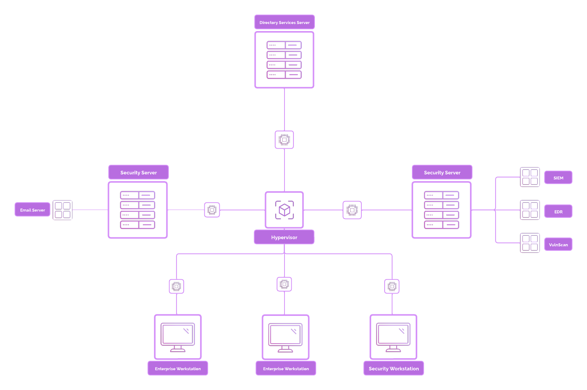
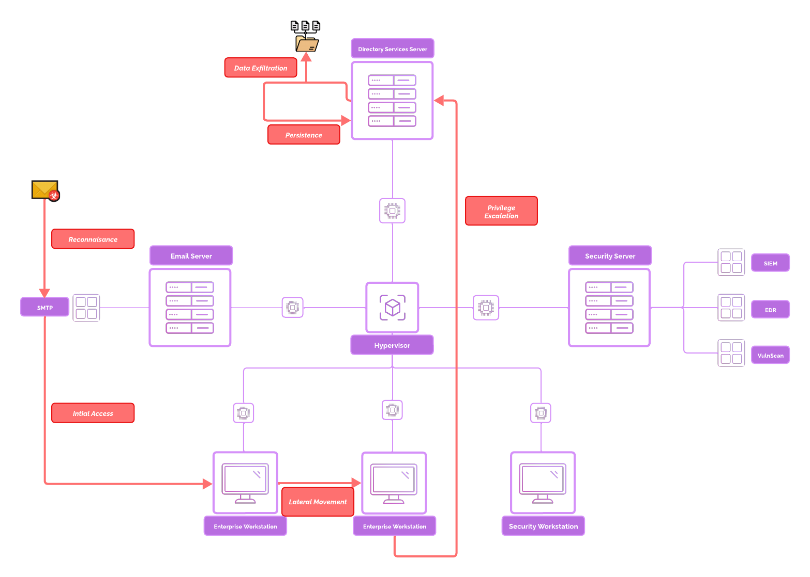
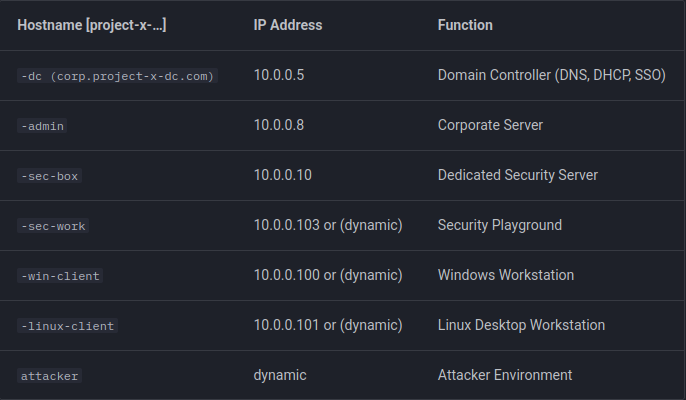
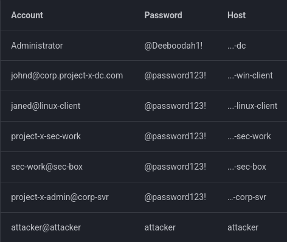
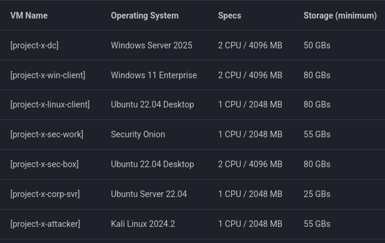

# ProjectX
Reason for creating this project:
With this project, I want to build a basic home lab.
It will contain different technologies, from servers to hosts.
It will be an intentionally vulnerable network, that I will then use to test different tools and methods for gaining and maintaining access to a system.

Network topology:

My network will contain the following components:
- Windows Server 2022: Designed to support enterprise-level applications and network management, and identity management. This will be used as the directory services server, acting as the central hub for network connection.
- Windows 11 Enterprise: Desktop operating system optimized for everyday productivity. Most common operating system used in business environments for employees. This will be used to simulate a business user.
- Ubuntu Desktop 22.04: General-purpose desktop. Commonly used for software development. This will be used to simulate an enterprise software development environment.
- Security Onion: An open-source platform for security monitoring, log analysis, and intrusion detection, used by cybersecurity professionals to detect, investigate, and respond to network threats and incidents.
- Ubuntu Server 2022: A Linux server operating system widely used for hosting applications, databases, and web services. This will be used as our email server.
- Kali Linux: A Debian-based Linux distribution tailored for penetration testing and ethical hacking. It comes pre-installed with a wide range of tools for vulnerability assessment, exploitation, wireless testing, and digital forensics.

Services I implemented:
- Microsoft Active Directory: A directory service used for managing and organizing network resources, users, and permissions in a Windows environment.
- Wazuh: An open-source security monitoring platform that provides intrusion detection, log analysis, vulnerability detection, and compliance reporting.
- MailHog: MailHog is a lightweight email testing tool that acts as a fake SMTP server. It captures all outgoing emails sent by applications, without delivering them to real inboxes. You can inspect emails via a web interface or API.

Offense tools I used:
- Evil-WinRM: A powerful Ruby-based Windows Remote Management (WinRM) client used by penetration testers to connect to and interact with Windows systems, often for post exploitation tasks such as command execution and data extraction.
- Hydra: A fast and flexible password-cracking tool designed to perform brute-force and dictionary-based attacks on various network protocols, including SSH, HTTP, FTP, and more.
- SecLists: A comprehensive collection of penetration testing resources, including wordlists for usernames, passwords, web directories, and other payloads used in reconnaissance and exploitation phases.
- NetExec: A network exploitation tool that enables remote command execution on target machines through various protocols, assisting in lateral movement and privilege escalation scenarios.
- XFreeRDP: An open-source implementation of the Remote Desktop Protocol (RDP), enabling penetration testers to connect to and control Windows systems remotely for reconnaissance and post-exploitation purposes.

## Cyber attack simulation

## Hosts

## Accounts and passwords

## Virtual machines

