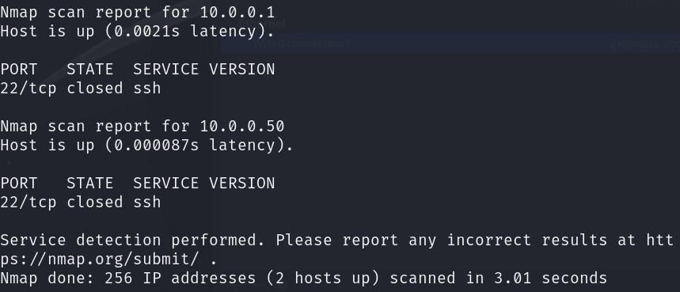
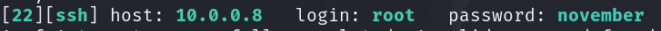

This is the initial step in a cyber attack or security assessment where attackers or penetration testers gather information about their target.
The primary goal is to understand the target’s systems, networks, and environment to identify potential vulnerabilities or points of entry.
Reconnaissance is used to collect as much data as possible about the target without actively engaging or alerting the target. It involves gathering information that will inform the next steps of the attack or test. 

nmap (Network Mapper): Open-source tool used for network discovery and security auditing. It allows users to scan and map networks to identify live hosts, open ports, running services, and system vulnerabilities. 

Every action will be done from the Kali Linux machine I configured previously.
- from the Kali terminal, I use: `nmap -p1-1000 -Pn -sV 10.0.0.8/24` 
	- -p: scan ports 1 to 1000
	- -sV: initiate service scan discovery
	- -Pn: bypass ping blocking

- the search found a running IP address, running a SSH service on port 22.
- I can use a password cracking tool to brute force my way into the SSH, using a wordlist file, like rockyou.txt, which comes by default with Kali.
Hydra: Password-cracking tool used for brute-force attacks on various network services. It automates the process of attempting multiple username and password combinations to gain unauthorized access to systems.

- `hydra -l root -P /usr/share/wordlists/rockyou.txt ssh://10.0.0.8`
- in this example I use root as the username, but it is possible to use a list for this as well, with the flag -L and a path to a username list

- I can use this to log in as root to the machine with that IP address using the SSH protocol

