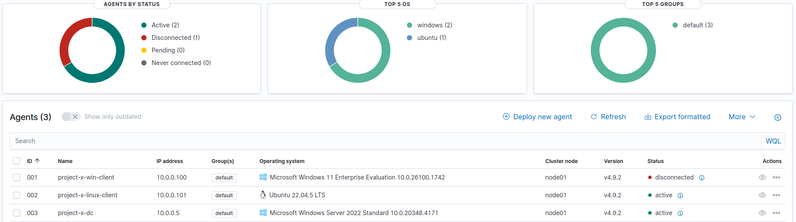

A dedicated security server is used for ensuring the performance, security, and scalability of your monitoring and analysis stack.
Why use a dedicated server for this operations and not use the already configured corporate server?
**Performance Isolation**: Running resource-intensive tools on a dedicated server prevents performance degradation caused by competing workloads on shared resources. Each application demands significant CPU, RAM, and disk I/O to function efficiently
**Enhanced Security**: Security tools process sensitive data, including logs and vulnerability scans. A dedicated server minimizes the attack surface by isolating these critical processes from unrelated systems.
**Centralized Management**: A dedicated server simplifies monitoring and management, providing a single point for handling logs, alerts, and vulnerability data, which improves efficiency and reduces administrative overhead.

After setting up the Ubuntu VM and adding a new user: sec-user with sudo privileges, I added the new userto the Active Directory.


In the active directory i created a new group, called Domain admins, and I added the sec-box user to this new domain group 


After all this, i can move on to configuring Wazuh.
Wazuh is an open-source platform that provides extended detection response (XDR) and System Information and Event Management (SIEM) to protect cloud, container, and server workloads.
Wazuh comes with an array of capabilities including log data analytics, intrusion and malware detection, file integrity monitoring (FIM), configuration assessment, vulnerability detection, and support for regulatory compliance.
- **Extended Detection Response (XDR)**: XDR is a defensive approach that integrates data and insights from multiple security layers. Data is collected and aggregated into a unified platform from data sources such as workstations, servers, cloud environments, and network traffic. XDR provides improved detection, investigation, and response to threats by centralizing all data to identify patterns, trends, and analyze malicious activity. In the context of Wazuh, there are many capabilities and features which enable XDR including multi-source data collection, threat detection, intrusion detection, incident investigation, and file integrity monitoring (FIM).
- **System Information and Event Management (SIEM)**: Refers to a system that combines log management, threat detection, and incident response to help organizations monitor and secure their IT environments. Wazuh acts as a SIEM solution by collecting and analyzing security data from multiple sources, detecting threats in real time, and facilitating efficient incident response.
Wazuh relies on an agent-based ecosystem. Software agents are deployed to workstations, servers, containers, and virtual machines which send data to Wazuh’s server for processing, aggregation, and visualization of security-relevant information.


**Centralized Configuration (agent.conf)**
Configuration changes and centralized management are applied to all agents via the Wazuh manager. The `agent.conf` file is edited on the Wazuh manager to define settings such as log collection rules, configuration changes and active response policies. This is best used for environments with many agents where centralized management is preferred.

- I used the following command to install wazuh on my project-x-sec-box machine:
curl -sO https://packages.wazuh.com/4.9/wazuh-install.sh && sudo bash ./wazuh-install.sh -a -i
- after the installation is complete, i search for localhost on my browser and log in using the credentials from the installation process


First thing i will do after these steps are complete is to deploy my first agent, on the windows client machine. For this i will generate, inside the wazuh dashboard, the necessary commands to run on the linux machine:
```
Invoke-WebRequest -Uri https://packages.wazuh.com/4.x/windows/wazuh-agent-4.9.2-1.msi -OutFile $env:tmp\wazuh-agent; msiexec.exe /i $env:tmp\wazuh-agent /q WAZUH_MANAGER='10.0.0.10' WAZUH_AGENT_NAME='project-x-win-client'
```
 After running this command, i use the "NET START WazuhSvc" command to start the agent.
 Now the new agent should be visible on the Wazuh dashboard.

The steps are identical for connecting the Active Directory server to Wazuh.

The process is similar on the linux machine, with a few additional terminal commands for starting the process.


This is what the Wazuh dashboard will look like after setting up all the agents.



After this part is complete i need to add each agent to a specific group.
For this project the agents will be separated based on the OS, in two groups, one for Windows and one for Linux.


Now i need to add specific configurations to the agent.conf file for each group. This will allow me to have custom log data for each group.
```xml
<agent_config>
 <!-- Shared agent configuration here -->
 <localfile>
 <location>Security</location>
 <log_format>eventchannel</log_format>
 </localfile>
 <localfile>
 <location>Application</location>
 <log_format>eventchannel</log_format>
 </localfile>
</agent_config>
```

```xml
<agent_config>
 <localfile>
 <log_format>syslog</log_format>
 <location>/var/log/auth.log</location>
 </localfile>
 <localfile>
 <log_format>syslog</log_format>
 <location>/var/log/secure</location>
 </localfile>
 <localfile>
 <log_format>audit</log_format>
 <location>/var/log/audit/audit.log</location>
 </localfile>
</agent_config>
```
