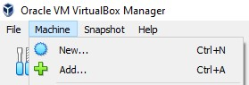
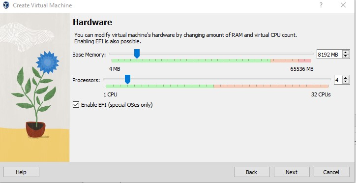

# Hypervisor

The virtualization software I chose for this project is VirtualBox.
This is a type 2 hypervisor, which means it runs on top of the existing operating system.

It can be used to install vulnerable VMs to practice skills, network configurations, or simulate small networks, all in a safe, isolated space. 
I chose VirtualBox beacause it is easy to install and to use, so it is perfect for a small home lab such as this one.

# VirtualBox Networks

This project uses the NAT Network setting, which allows the VMs to communicate with each other, while also having access to the internet through a server running DNS that will be set up later in the project.

#Creating a new virtual machine

This method will be used for all VMs in this project, the only thing changing will be the ISO file.

- in the VirtualBox main page, go to Machine -> New

- enter the name of the virtual machine
- choose the default folder location
- select the right type and version for the VM you want to create

- add hardware specification, depending on the operating system requirements of the VM being created

- at this point, when you start the virtual machine, it does not have a OS to boot. This needs to be added as an ISO, from the host machine
