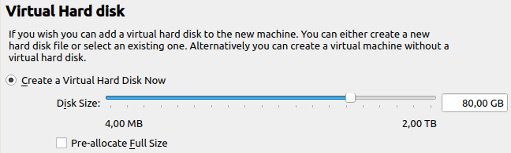

## Hypervisor
A hypervisor is a software layer that creates and runs virtual machines (VMs). It alllows multiple operating systems to share a single physical hardware host by abstracting and partitioning the host's resources (CPU, memory, storage) among the VMs.

Types:
 - Type 1 (bare metal): runs directly on hardware
 - Type 2 (hosted): runs as an application on an existing OS

For this project I will be using VirtualBox as my hypervisor.
It is a type 2 hypervisor because it is easy to install and straight forward to use.

First step is to create a NAT network in VirtualBox. This will allow me to connect all my virtual machines to the same network and to set the Active Directory machine as the gateway to the rest of the Internet.

## Active Directory Set Up

Active Directory (AD) is a directory service developed by Microsoft that manages and organizes resources in a network. It acts as a centralized database to authenticate and authorize users and devices, making it the backbone of most Windows-based enterprise environments.
There are three key components in AD:
 - Authentication: Verifies user identity using credentials like username and password.
 - Authorization: Grants or denies access to network resources based on permissions.
 - Management: Centralizes control over users, computers, and other resources.

A domain is a logical grouping of objects (users, devices, etc.) that share the same database and security policies.
corp.project-x-dc.com will be the domain used in this project.
Domain Controllers (DCs) - Servers that host the Active Directory database and perform authentication, authorization, and replication to other AD databases.
Objects - Every entity in AD, such as users, computers, printers, and groups, is an object.
Groups - Security Groups: Used for managing permissions to resources.
 Forest and Trees - A forest is the highest-level container, encompassing multiple domains that share a common schema. - A tree is a hierarchy of domains within a forest.

After that, I can start configuring my first VM, running windows server 2025:
First i need to choose the ISO image i the OS will boot from, in this case it is a Windows server 2022 OS, then i assign the hardware specifications and the size of the virtual hard disk:

Now i let the OS boot and i can continue with the setup of the Active Directory server.
 - configure the static IPv4 properties

 - configure domain for my AD server:

 - set up Active Directory Domain Services
 - this server will aslo act as the DNS and DHCP server for my network

- adding the 8.8.8.8 address (google DNS server's address) as a forwarder to my DNS server, so that my network can access the internet
- for the DHCP server part, I will add a new scope (10.0.0.100 - 10.0.0.200) and a default gateway (10.0.0.1)

Next, I will be adding two new users to the Active Directory: John Doe and Jane Doe.

## Windows 11 Enterprise Set Up

Now i need to set up a VM with windows 11 enterprise.
 The setup steps are similar to the AD server:
 - first, i need to configure a static ip address for this VM, with the DNS server address set to the address of my AD VM

 - then i change the name of the computer and set it to be a member of the domain i set up in the AD

